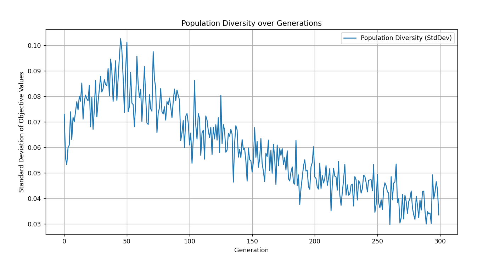

# Genetic Algorithm for Black-Box Optimization


## 📌 Project Description

This project presents the implementation of a Genetic Algorithm (GA) designed to solve a "black-box" optimization problem. The primary challenge is to find the global minimum of a given objective function, $f(w)$, whose analytical form is unknown. The function operates on a high-dimensional input vector, **w**, defined in a 60-dimensional space. Interaction with the function is restricted to a computational interface that provides an output value for a given input vector.

This setup precludes the use of traditional gradient-based optimization methods. The vastness of the 60-dimensional search space also makes any form of brute-force or exhaustive search computationally infeasible. Therefore, a sophisticated search heuristic like a Genetic Algorithm is an ideal approach. GAs are stochastic search methods inspired by natural evolution that do not require gradient information, making them perfect for this task.

This implementation aims to effectively balance **exploration** of the vast search space with **exploitation** of promising regions to reliably converge to a high-quality solution.

## Key Features

- **Object-Oriented Design:** The entire algorithm is encapsulated in a modular and reusable `GeneticAlgorithm` class in Python.
- **Advanced Operators:** Implements sophisticated operators for real-coded problems:
  - **Selection:** Tournament Selection with Elitism.
  - **Crossover:** Simulated Binary Crossover (SBX).
  - **Mutation:** Polynomial Mutation.
- **Dynamic Adaptation:** Features a dynamic adaptation mechanism for mutation strength, which decreases over generations for a better balance between initial exploration and final fine-tuning.
- **Performance Visualization:** Generates plots for convergence analysis (best and average fitness) and population diversity.

## File Structure

```
.
├── assets
│   ├── slika1.png
│   └── slika2.png
├── genetic_algorithm.py
├── ann_criterion.py
└── README.md
```
## 📚 Table of Contents
- [Project Description](#project-description)
- [Key Features](#key-features)
- [File Structure](#file-structure)
- [Requirements & Installation](#requirements--installation)
- [How to Run](#how-to-run)
- [Algorithm Architecture and Implementation Details](#algorithm-architecture-and-implementation-details)
  - [Individual Representation](#individual-representation)
  - [Initial Population](#initial-population)
  - [Fitness Function](#fitness-function)
  - [Selection Strategy](#selection-strategy)
  - [Crossover Operator: Simulated Binary Crossover (SBX)](#crossover-operator-simulated-binary-crossover-sbx)
  - [Mutation Operator: Polynomial Mutation](#mutation-operator-polynomial-mutation)
- [Hyperparameter Tuning](#hyperparameter-tuning)
- [Results and Convergence](#results-and-convergence)
- [Conclusion](#conclusion)

## Requirements & Installation

The project requires Python 3 and the following libraries:
- `numpy`
- `matplotlib`

You can install them using pip:
```bash
python -m pip install numpy matplotlib
```

## How to Run

To run the optimization process, simply execute the main script from your terminal:
```bash
python genetic_algorithm.py
```
The script will print the progress to the console and display the result plots upon completion.

## Algorithm Architecture and Implementation Details

### Individual Representation
An individual in the GA represents a potential solution to the problem, i.e., a specific vector **w**. It is implemented as a 60-element NumPy array, where each element (gene) is a real number corresponding to a dimension of the input vector.

### Initial Population
The initial population is generated within the `_initialize_population()` method. Each gene of each individual is assigned a random value using a **uniform probability distribution** within the predefined bounds of `[-10, 10]`. This ensures a diverse starting point, with solutions spread evenly across the entire search space.

### Fitness Function
Since the goal is to **minimize** the objective function $f(w)$, while the GA works by **maximizing** fitness (by definition), a transformation is recommended. In combination with Tournament Selection, a simple and computationally efficient **negation** was used:
$$F(w) = -f(w)$$
This ensures that a smaller objective value corresponds to a larger fitness score. Tournament selection works flawlessly with this method as it only relies on comparison, not the absolute value or sign of the fitness score.

### Selection Strategy
A hybrid strategy combining **Tournament Selection** and **Elitism** was implemented.
- **Tournament Selection:** For each parent selection, `k=3` individuals are chosen randomly from the population. The individual with the best fitness score among the three is declared the winner and selected as a parent. This method is efficient and provides excellent control over selection pressure.
- **Elitism:** Before selection, a set number of the best individuals (`elitism_count: 3`) are identified and copied directly to the next generation. This guarantees that the best-found solution is never lost due to the stochastic nature of crossover and mutation.

### Crossover Operator: Simulated Binary Crossover (SBX)

The SBX operator, implemented in the `_crossover` method, was chosen for its effectiveness in real-coded problems, as it emulates the behavior of the single-point crossover used in binary GAs, but on the level of real numbers. Its key advantage is its **self-adaptive nature**, where the spread of the offspring generated depends on the distance between the parents.

The crossover process is executed after the parent individuals are selected for reproduction. It is implemented as follows: First, the operator is not applied to all parents, but is triggered based on a probability defined by the `crossover_rate` parameter. The selected parents are then randomly paired up. For each pair of parents ($p_1$, $p_2$), the SBX logic is applied to each gene (dimension) individually.

The core of the operation is the calculation of the spread factor $β$ based on a random number $u \in [-10, 10]$ and the distribution index $η_c$ (defined in the code as `crossover_eta`):

$$
β = 
\begin{cases} 
(2u)^{1/(η_c+1)}, & \text{if } u \leq 0.5 \\
(1/(2(1-u)))^{1/(η_c+1)}, & \text{if } u > 0.5 
\end{cases}
$$

The offspring's genes ($c_1$, $c_2$) are then generated based on the parents' genes ($p_1$, $p_2$) and the spread factor $β$ using the following formulas:

$$c_{1} = 0.5 \times [(1 + β)p_{1} + (1 - β)p_{2}]$$
$$c_{2} = 0.5 \times [(1 - β)p_{1} + (1 + β)p_{2}]$$

As a final step, the value of each newly generated gene is checked. If it falls outside the defined bounds of `[-10, 10]`, it is clipped to the nearest boundary value using the `numpy.clip` function. This entire approach allows the algorithm to be more explorative in early generations when solutions are diverse and parents are far apart, and more exploitative during the final fine-tuning phase when the population has converged and parents are close together.

### Mutation Operator: Polynomial Mutation

Polynomial Mutation was implemented in the `_mutation` method to introduce new genetic information and prevent premature convergence. This operator is applied to each gene of each offspring individually, with a probability defined by the `mutation_rate`. A key feature of this implementation is the **dynamic adaptation of mutation strength**, where the influence of the mutation decreases as the algorithm approaches an optimal solution. This is achieved by linearly changing the `eta` parameter from an initial to a final value over the course of the generations. At the beginning of the evolution, when the `eta` value is lower, the algorithm encourages **exploration** by allowing larger changes to the genes. In the later stages, `eta` increases, resulting in much smaller perturbations suitable for the **fine-tuning** of the solution.

The core of the operator is the calculation of the new gene value $y'$ based on its original value $y$:

$$y' = y + δ_q \times (y_{high} - y_{low})$$

The entire process revolves around calculating the perturbation factor $δ_q$. Below is a detailed breakdown of all the variables involved in this calculation.

-   **$y$, $y_{low}$, $y_{high}$**: These are the basic inputs for the mutation of a single gene.
    -   **$y$**: The current, original value of the gene being mutated.
    -   **$y_{low}$** and **$y_{high}$**: The lower and upper bounds of the allowed range for that gene (in our case, `-10` and `10`).

-   **$η_m$ (eta_m)**: This is the **distribution index**, the key parameter controlling the strength or "aggressiveness" of the mutation. In our code, this value is dynamic.
    -   A **high $η_m$** (e.g., 100) results in a very small perturbation ($δ_q$ is close to zero), which is suitable for **fine-tuning**.
    -   A **low $η_m$** (e.g., 5) allows for larger perturbations, which encourages **exploration**.

-   **$δ_1$ and $δ_2$**: These are helper values that provide the algorithm with "contextual awareness," i.e., how close the gene is to its boundaries.
    $$δ_1 = \frac{y - y_{low}}{y_{high} - y_{low}}$$
    $$δ_2 = \frac{y_{high} - y}{y_{high} - y_{low}}$$

-   **$r$**: This is a randomly generated number from a uniform distribution between 0 and 1 (`numpy.random.rand()`). Its role is to act as a **"coin flip"** that, with a 50% chance, decides whether the perturbation will be positive (increasing the gene's value) or negative (decreasing it).

-   **$δ_q$ (delta_q)**: This is the final **perturbation value** (the change), calculated based on all the previous parameters.

    If `r < 0.5`, the perturbation is calculated using the distance from the lower bound ($δ_1$) with the following formula, which produces a **negative** value to pull the gene downwards:
    $$δ_q = [2r + (1 - 2r)(1 - δ_1)^{η_m+1}]^{1/(η_m+1)} - 1 $$

    If `r ≥ 0.5`, the perturbation is calculated using the distance from the upper bound ($δ_2$) with the following formula, which produces a **positive** value to push the gene upwards:
    $$δ_q = 1 - [2(1 - r) + 2(r - 0.5)(1 - δ_2)^{η_m+1}]^{1/(η_m+1)} $$

Finally, after the new value $y'$ is calculated, a check is performed using `numpy.clip` to ensure the value remains strictly within its defined bounds.

## Hyperparameter Tuning

The algorithm's parameters were empirically tuned to achieve a robust balance between exploration and exploitation for this specific problem.

| Parameter | Value | Justification |
| :--- | :--- | :--- |
| `pop_size` | 250 | A large population is necessary to maintain diversity in a 60D search space. |
| `generations` | 300 | Analysis showed that major improvements occur within this timeframe, balancing performance and efficiency. |
| `crossover_rate` | 0.9 | A high rate to prioritize the combination of successful solutions. |
| `crossover_eta` | 5 | A low `eta` value encourages exploration by creating more diverse offspring. |
| `mutation_rate` | 0.04 | A slightly elevated rate ensures a steady influx of new genetic material to prevent stagnation. |
| `mutation_eta_schedule`| (5,50) | Starts with explorative mutations (low `eta`) and transitions to fine-tuning (high `eta`). |
| `selection_k` | 3 | A standard tournament size that provides moderate and stable selection pressure. |
| `elitism_count` | 3 | Preserves the 3 best-found solutions in each generation. |
| `stagnation_limit` | 15 | An early stopping criterion to save computational resources if no improvement is found. |

## 📊 Results and Convergence

The algorithm was run multiple times to test for consistency. The results demonstrate high robustness, with the final objective value consistently converging to a narrow range between **0.024** and **0.031**. The best solution found across all test runs was **$f_{min}(w) = 0.02396133$**. This consistency suggests that the algorithm reliably finds the same high-quality region of the search space.

The typical behavior of the algorithm is shown in the convergence and diversity plots below.


*Figure 1: A convergence plot showing the best and average fitness per generation.*


*Figure 2: A plot showing population diversity (measured by standard deviation) over generations.*

## Conclusion

The implemented Genetic Algorithm proved to be a successful and efficient method for solving the given high-dimensional "black-box" optimization problem. Through a carefully designed architecture using advanced operators and dynamic parameter adaptation, the algorithm demonstrated robust and consistent convergence to high-quality solutions. This project successfully showcases the power and flexibility of Genetic Algorithms in tackling complex optimization challenges where traditional methods are not applicable.
